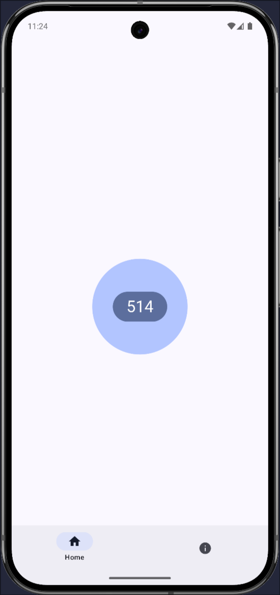
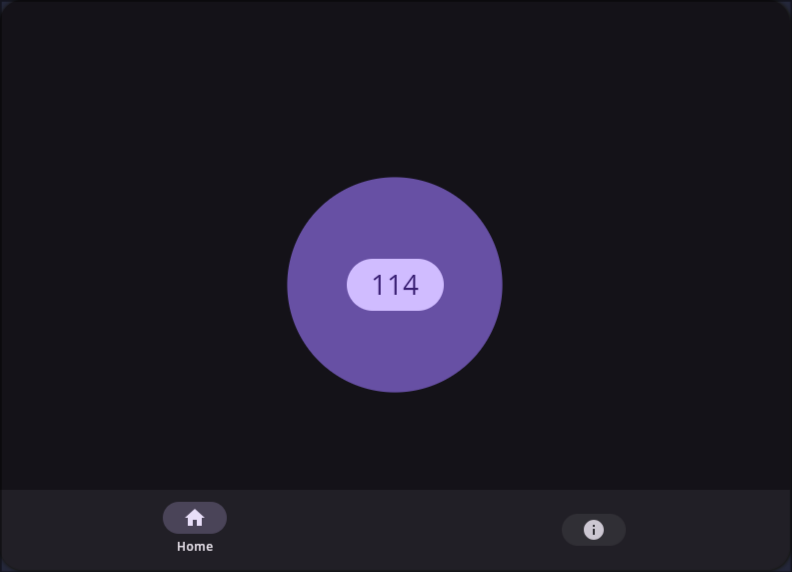

# Counter

> Rewrite Counter in Kotlin Multiplatform

## Introduction

When you click the button, the number will increase by 1.

## Basic Info

### Platform

- [x] Android
- [x] Desktop

### Features

- [x] Save the number to the database
- [x] Dark mode

## Screenshots

| Android (light)                     | Desktop (dark)                      |
|-------------------------------------|-------------------------------------|
|  |  |

## Dependencies

- Kotlin Multiplatform
- Lifecycle ViewModel Compose
- Material3 Compose
- Navigation Compose
- SqlDelight

> Refer to [libs.versions.toml](gradle/libs.versions.toml)

## License

MIT